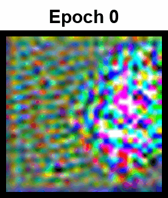
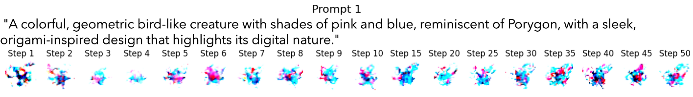
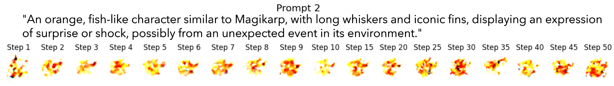

# Advanced Text-to-Image Diffusion Model Training Script

This repository contains a sophisticated script for training a text-to-image diffusion model using the Hugging Face Diffusers library. It implements a custom Text-to-Image pipeline and leverages advanced techniques for text conditioning in diffusion models.


## Table of Contents

- [Features](#features)
- [Requirements](#requirements)
- [Installation](#installation)
- [Usage](#usage)
- [Key Arguments](#key-arguments)
- [Model Architecture](#model-architecture)
- [Text Conditioning in Diffusers](#text-conditioning-in-diffusers)
- [Custom Text-to-Image Pipeline](#custom-text-to-image-pipeline)
- [Logging and Visualization](#logging-and-visualization)
- [Checkpointing](#checkpointing)
- [Distributed Training](#distributed-training)
- [Performance Optimization](#performance-optimization)
- [Troubleshooting](#troubleshooting)
- [Contributing](#contributing)
- [License](#license)
- [Acknowledgements](#acknowledgements)

## Features

- Trains a UNet2DConditionModel for text-conditional image generation
- Uses a CLIP text encoder for processing text prompts
- Implements noise scheduling and diffusion process
- Supports EMA (Exponential Moving Average) for model weights
- Allows resuming training from checkpoints
- Generates sample images during training for visual inspection
- Logging with TensorBoard or Weights & Biases
- Distributed training support via Accelerate
- Custom Text-to-Image pipeline for inference
- Advanced text conditioning techniques
- Support for various prediction types (epsilon, sample, v_prediction)
- Mixed precision training
- xFormers memory-efficient attention (optional)

### Some of the best generated samples

A cheerful Koffing Pokémon surrounded by puffs of its own gas emissions.

 

A cheerful orange-pink Lickitung with its long tongue lolling out is ready for a Pokémon battle.


## Requirements

- Python 3.7+
- PyTorch 1.10+
- Hugging Face Transformers 4.25+
- Hugging Face Diffusers 0.28.0+
- Accelerate 0.16.0+
- datasets
- PIL
- tqdm
- matplotlib
- tensorboard (optional, for logging)
- wandb (optional, for logging)
- xformers (optional, for memory-efficient attention)

## Installation

1. Clone this repository:
```bash
git clone https://github.com/KetanMann/Text_2_Img_Diffusion_Model_Training_Script
cd Text_2_Img_Diffusion_Model_Training_Script
```
2. Install the required dependencies:
```bash
pip install -r requirements.txt

# Source Install
pip install git+https://github.com/huggingface/diffusers 
```
## Usage

1. Prepare your dataset. The script supports:
- HuggingFace datasets
- Local image folders with metadata

2. Run the training script:
```bash
!accelerate launch --multi_gpu training_script_diffusion.py \
  --dataset_name="diffusers/pokemon-gpt4-captions" \
  --resolution=32 \
  --output_dir=/kaggle/working/nouns_models \
  --train_batch_size=3 \
  --dataloader_num_workers=4 \
  --eval_batch_size=1 \
  --num_epochs=20000000 \
  --use_ema \
  --gradient_accumulation_steps=4 \
  --learning_rate=1e-4 \
  --lr_warmup_steps=1000 \
  --mixed_precision="no" \
  --save_images_epoch=7 \
  --ddpm_beta_schedule="squaredcos_cap_v2" \
  --checkpointing_steps=2000 \
  --resume_from_checkpoint="latest" \
  --prediction_type="sample" \
  --logger="wandb" \
  --image_column="image" \
  --caption_column="text" 
```
## Key Arguments

- `--dataset_name`: Name of the dataset to use (from HuggingFace datasets)
- `--train_data_dir`: Path to local training data (if not using a HF dataset)
- `--output_dir`: Directory to save model checkpoints and generated images
- `--resolution`: Image resolution for training
- `--train_batch_size`: Batch size for training
- `--num_epochs`: Number of training epochs
- `--learning_rate`: Initial learning rate
- `--use_ema`: Enable Exponential Moving Average for model weights
- `--push_to_hub`: Push model to HuggingFace Hub after training
- `--mixed_precision`: Use mixed precision training ("no", "fp16", "bf16")
- `--enable_xformers_memory_efficient_attention`: Use xFormers for memory-efficient attention

### Image Generation(Progression)
Here are 2 examples(32x32) showing denoising process with number of steps. After training 30 to 50 steps are enough to generate good images.





For a full list of options, run:
```bash 
python training_script_diffusion.py --help
```
## Model Architecture

The script trains a UNet2DConditionModel with cross-attention for text conditioning. The model architecture includes:

- Multiple down and up sampling blocks
- Cross-attention layers for text conditioning
- Residual connections
- Normalization layers

The exact architecture can be customized through the script arguments or by modifying the UNet2DConditionModel initialization.

### Training Epoch Progression.
Prompt = ""A powerful Gyarados unleashes a roar, showcasing its fierce expression and serpentine body, ready for battle."
All 32x32 images at different epochs of training, were upscaled(256x256) to make this gif. That's why it is hazy. 


## Text Conditioning in Diffusers

Text conditioning in this diffusion model is achieved through several key components:

1. **CLIP Text Encoder**: The script uses a pre-trained CLIP text encoder to process text prompts. This encoder converts text into a high-dimensional embedding space.

2. **Cross-Attention Mechanism**: The UNet2DConditionModel incorporates cross-attention layers. These layers allow the image features to attend to the text embeddings, effectively conditioning the image generation on the text.

3. **Conditioning Scale**: The strength of the text conditioning can be adjusted during inference, allowing for more or less adherence to the text prompt.

4. **Classifier-Free Guidance**: While not explicitly implemented in this script, the framework supports classifier-free guidance, which can enhance the text-image alignment during generation.

## Custom Text-to-Image Pipeline

The script implements a custom `TextToImagePipeline` class, which encapsulates the entire text-to-image generation process. This pipeline:

1. Tokenizes and encodes the input text prompt
2. Generates initial noise
3. Gradually denoises the image according to the diffusion process
4. Incorporates the text conditioning at each denoising step

The custom pipeline allows for easy inference and can be easily extended or modified for specific use cases.

## Logging and Visualization

- The script logs training progress and metrics using TensorBoard or Weights & Biases.
- Sample images are generated periodically during training for visual inspection.
- Learning rate, loss, and other metrics are logged and can be visualized in real-time.

## Checkpointing

The model is saved at regular intervals and at the end of training. You can resume training from a checkpoint using the `--resume_from_checkpoint` argument. The script also supports keeping a limited number of checkpoints to save disk space.

## Distributed Training

The script uses the Accelerate library to support distributed training across multiple GPUs or nodes. This allows for efficient scaling of the training process to larger datasets and model sizes.

## Performance Optimization

- Mixed precision training is supported to reduce memory usage and increase training speed.
- xFormers memory-efficient attention can be enabled for further performance improvements on supported hardware.

## Troubleshooting

If you encounter issues:

1. Ensure all dependencies are correctly installed and up to date.
2. Check that your dataset is properly formatted and accessible.
3. For CUDA out of memory errors, try reducing the batch size or image resolution.
4. Enable logging for more detailed error messages.

## Contributing

Contributions to improve the script or extend its functionality are welcome. Please feel free to submit pull requests or open issues for bugs and feature requests.


## Acknowledgements

This script is based on the Hugging Face Diffusers library and incorporates techniques from various text-to-image diffusion models. Special thanks to the open-source community for their contributions to the field of generative AI.
